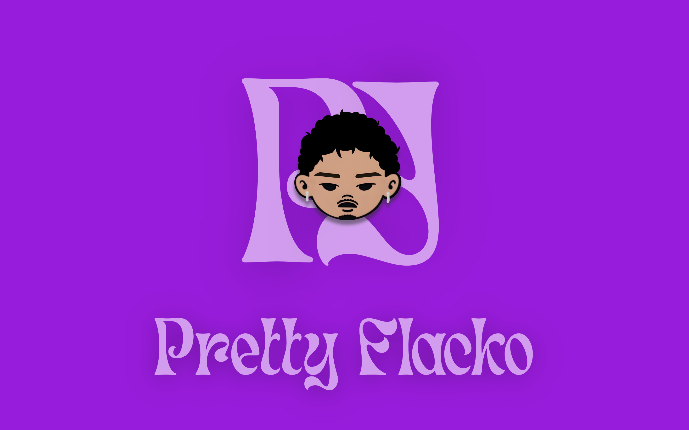

<!--  -->

 

# 👋 Hi, I’m Pretty Flacko aka @ANome1

🎓 CS student @ Ynov Campus | ⚡ 20 yo
💻 Currently learning **Go** | 🐍 Comfortable with **Python** & **Frontend Dev**

 

  <a href="https://prettyflacko.fr">🌐 Portfolio (Work in Progress 🚧)</a>

---

### 🛠️ Tech Stack

 
 

### 📂 Featured Projects

| Project | Description & Role | Tech Stack |
| :--- | :--- | :--- |
| **[🎧 Groupie Tracker](https://github.com/Lyon-Ynov-Campus/groupie-tracker-headphones)** | **Plateforme de jeux musicaux temps réel** (Blind Test & Petit Bac). *Role : Frontend, DB & Auth.* |    |
| **[YBOOSTER](https://github.com/ANome1/Yboost)** | **Plateforme d'ouverture de booster** (League of Legends). *Role : All project.* |   |

 

 

<!-- 

 -->
